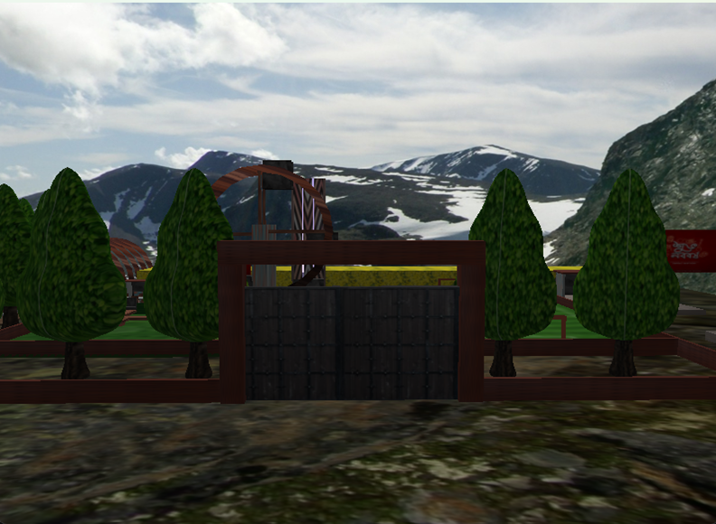
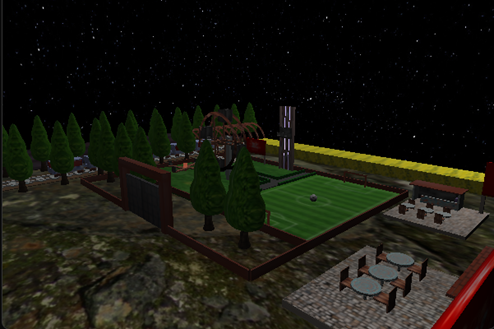
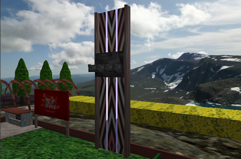
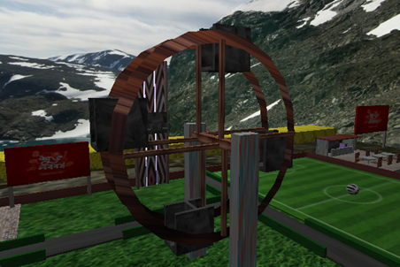
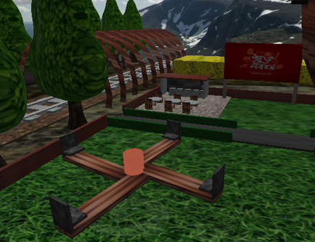
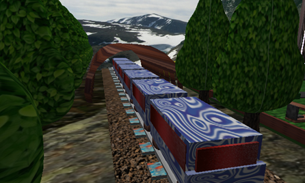
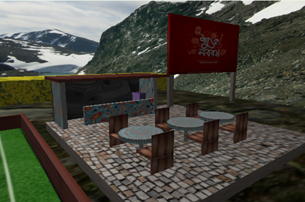
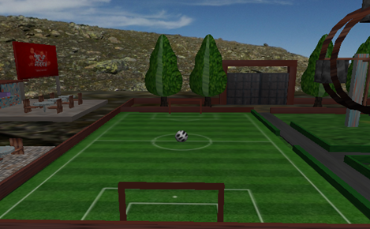
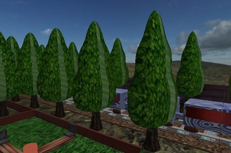

# 🏞️ 3D Village Fair

An interactive OpenGL-based simulation of a colorful and dynamic **village fair**, complete with animated rides, lighting effects, textured scenery, and keyboard-controlled exploration.

---

## 🎯 Objectives

- Build a **3D village fair** using OpenGL.
- Add **realistic movement**, **lighting**, and **textures**.
- Enable **user interaction** via keyboard for immersive exploration.

---

## 🎡 Features

- **🚂 Moving Rides**: Ferris Wheel, Circular Ride, and Flyer — all animated and controllable.
- **🎨 Textured Objects**: Trees, cafeteria, football field, rail track — all texture-mapped for realism.
- **💡 Realistic Lighting**: Directional, point, and spotlights with ambient, diffuse, and specular controls.
- **🧭 Interactive Environment**: Smooth camera control and movement via keyboard.
- **🌞🌙 Dual Modes**: Switch between **Day Mode** and **Night Mode**.

---

## 🕹️ Keyboard Controls

### 🚶 Movement
- `W / A / S / D` — Move forward / left / backward / right  
- `I / K` — Move up / down

### 🎥 Camera Control
- `X / Z` — Adjust pitch  
- `Y / U` — Adjust yaw  
- `E / Q` — Adjust roll

### 💡 Lighting Controls
- `1` — Toggle Directional Light  
- `2` — Toggle Point Light  
- `3` — Toggle Spot Light  
- `4` — Toggle Ambient Light  
- `5` — Toggle Diffuse  
- `6` — Toggle Specular

### 🎢 Ride Controls
- `M` — Open the gate  
- `N` — Close the gate  
- `O` — Start Ferris Wheel  
- `P` — Stop Ferris Wheel  
- `J` — Start Circular Ride  
- `H` — Stop Circular Ride  
- `F / G` — Increase / Decrease speed of Circular Ride  
- `R` — Start Flyer  
- `T` — Stop Flyer

---

## 🖼️ Screenshots


### Day Mode



### Night Mode



### Rides

- Flyer  
  

- Ferris Wheel  
  

- Circular Ride  
  

- Train  
  

### Objects

- Cafeteria  
  

- Football Field  
  

- Trees  
  

---

## ⚙️ Technical Highlights

- Implemented with **OpenGL and GLUT**.
- Used **Bezier curves** for smooth motion paths.
- Performance optimized for real-time rendering.

---

## 🧩 Challenges Faced

- Integrating smooth ride animations with Bezier curves.
- Managing performance with multiple dynamic objects.
- Fine-tuning light effects for night mode realism.
- Texture mapping across complex objects.

---

## ✅ Outcome

This project successfully showcases:
- Real-time animation and rendering.
- Interactive graphics programming in OpenGL.
- A complete, immersive virtual fairground environment.

---

## 🙏 Acknowledgments

- Developed by: **Md Kaisarul Islam**  
- Supervised by: **Dr. Sk. Md. Masudul Ahsan** & **Md. Badiuzzaman Shuvo**  
- Department of CSE, KUET

---

## 📂 How to Run

> Make sure you have OpenGL and GLUT configured in your environment.

1. Clone the repository:
   ```bash
   git clone https://github.com/yourusername/3d-village-fair.git
   cd 3d-village-fair
